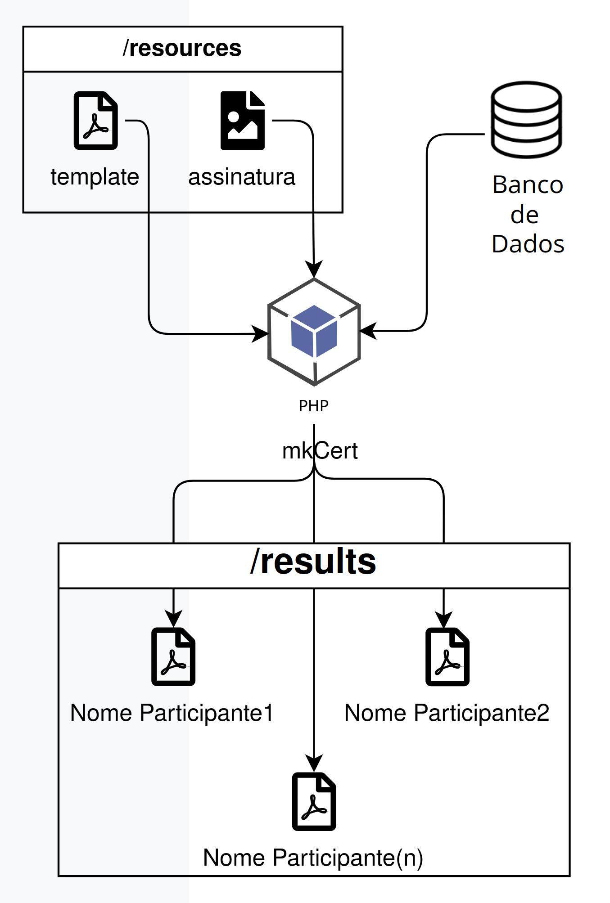

# Geração certificados de participação em .pdf
###### (ou para inserir algum texto, imagem ou HTML em arquivos PDF. Necessário modificações conforme necessidade)
<br>
## Motivação
Recentemente ao concluir um curso (on-line) fui surpreendido pela demora na geração do meu certificado de conclusão.  
Em contato com a instituição, fui informado que o processo de confecção do certificado leveria alguns dias. Após alguns dias de espera, recebi um arquivo .pdf com o certificado. Ao abri-lo notei que era apenas um símples PDF, sem criptografia, metadados, assinatura digital ou outros dados que justificassem a demora na emissão.  
Logo imaginei que, talves, o processo fosse manual ao invés de automatizado. Não que seja necessário um sistema só pra fazer isso. No pior dos casos um editor avançado de textos, que gere arquivos .pdf, já é o suficiente.  
Mas isso me incomodou e gerou certa curiosidade (como programador). Pois em meus anos de experiência, embora já tivesse trabalhado e desenvolvido rotinas para manipulação de arquivos .pdf (apenas operações do próprio S.O.), nunca havia "manipulado" as informações dentro de um arquivo .pdf.  
Foi então que decidi criar uma rotina para gerar de forma automática estes certificados. Partindo de um exemplo e apenas incluindo as informações necessárias.  
Sei que talvez haja códigos como este espalhados por toda a internet, ou que alguma IA faça isso de forma instantânea. Mas, e quanto aquele gostinho de ter feito você mesmo? Valeu pelo aprendizado.
<br>
<br>
### Dependências
- [PHP](https://www.php.net/) ^5.6 || ^7.0 || ~8.0.0 || ~8.1.0 || ~8.2.0 || ~8.3.0 (conforme exigências do mPDF)
- [composer](https://getcomposer.org/) na versão compatível com a versão do PHP instalada.
<br>
<br>

Com todas as dependências instaladas e o repositório clonado:  
```
composer install
```
```
php mkCert.php
``` 
<br>
O que o mkCert faz:  


<br>
<br>
Baseado no arquivo certificado.pdf do diretório /resources

```php
12 const PDF_SOURCE_FILE = 'certificado.pdf';
13 const PDF_SOURCE_DIRECTORY = 'resources/';
```  
e na imagem assinatura.png, também em /resources
```php
16 const PDF_SIGNATURE_FILE = PDF_SOURCE_DIRECTORY . '/assinatura.png';
```  
é feita a junção no arquivo com o "Nome do Participante.pdf" no diretório /results
###### (conforme constam exemplos)  
<br>
### Referencias  
>[mPDF](https://github.com/mpdf/mpdf)  
>[Composer](https://getcomposer.org/)  
>[Mockaroo](https://www.mockaroo.com/?utm_source=pocket_saves) - Utilizado para gerar os nomes para os testes.  
